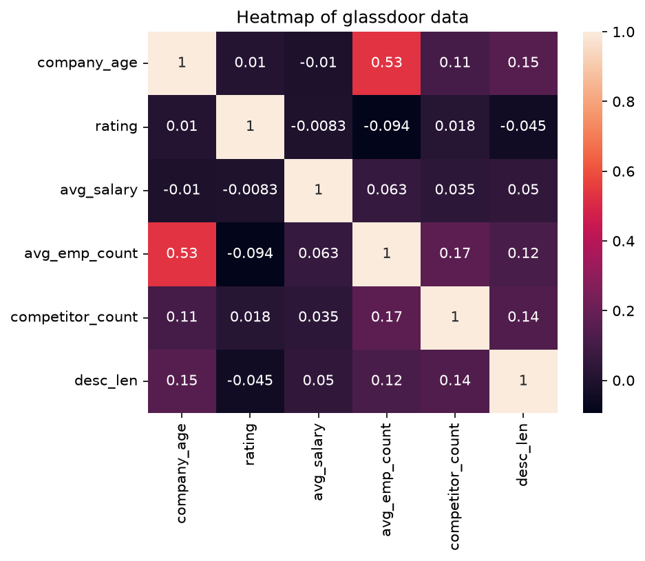
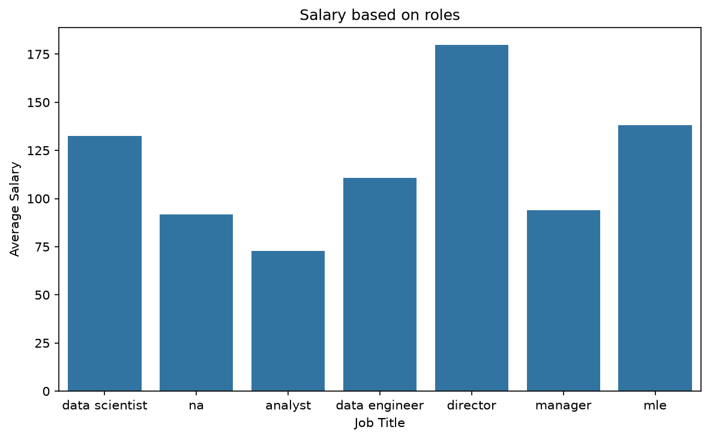
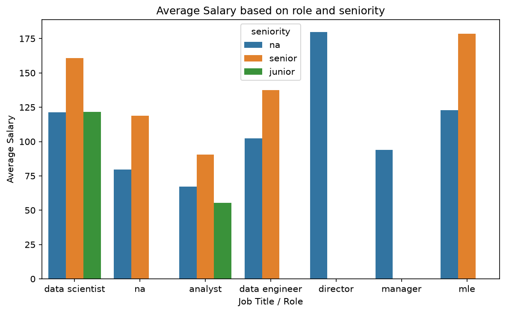
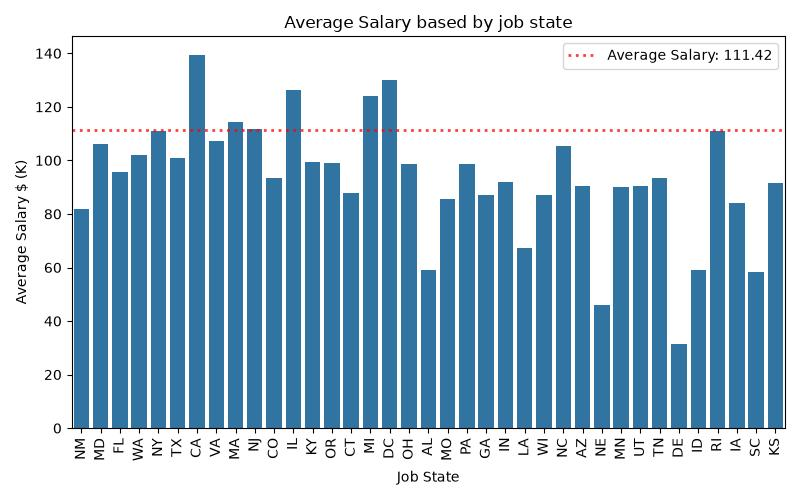
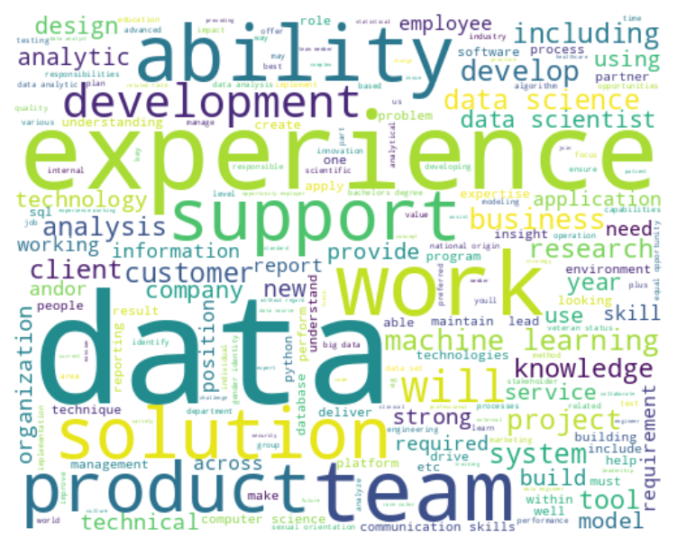

# Glassdoor data science job postings: salary analysis

An end-to-end data science project that analyzes **Glassdoor data science job postings** to estimate salary trends based on **required skills** and **company attributes**.

> **Main goal:** understand and quantify what drives a data science salary (the role, the skills listed in the job description, the company size/industry, and the job location) by cleaning the raw data, engineering meaningful features, and exploring the salary signal with visualizations.

---

## Table of contents

- [1. Problem statement](#1-problem-statement)
- [2. Dataset](#2-dataset)
- [3. Project structure](#3-project-structure)
- [4. Setup](#4-setup)
- [5. Methodology](#5-methodology)
  - [5.1 Data cleaning](#51-data-cleaning)
  - [5.2 Feature engineering](#52-feature-engineering)
  - [5.3 Exploratory data analysis](#53-exploratory-data-analysis)
- [6. Key findings](#6-key-findings)
- [7. Conclusion & next steps](#7-conclusion--next-steps)

---

## 1. Problem statement

Salary is one of the strongest signals a candidate has when evaluating a data science role. Yet job postings rarely expose it directly, with salaries often listed as ranges, in different formats, or tied to attributes that are not obvious (seniority, location, company size, required skill set).

This project answers the question:

> **Which factors (skills, role, seniority, company attributes, and location) drive the average salary of a data science job?**

The analysis pipeline:

1. **Cleans** the raw Glassdoor dataset (messy salary ranges, company names, sizes, and locations).
2. **Engineers** features such as parsed salary, company age, employee count, required-skill flags, job title, and seniority.
3. **Explores** how each factor correlates with, and breaks down against, `avg_salary`.

---

## 2. Dataset

- **Source:** [Jobs dataset from Glassdoor (Kaggle, 2018)](https://www.kaggle.com/datasets/thedevastator/jobs-dataset-from-glassdoor)
- **Raw file:** `data/raw/glassdoor_jobs.csv`
- **Cleaned file:** `data/cleaned/salary_data_cleaned.csv`
- **Granularity:** ~1,000+ individual data science job postings.

Key raw attributes include: `Job Title`, `Salary Estimate`, `Job Description`, `Rating`, `Company Name`, `Location`, `Headquarters`, `Size`, `Founded`, `Type of ownership`, `Industry`, `Sector`, `Revenue`, and `Competitors`.

---

## 3. Project structure

```
glassdoor-project/
├── data/
│   ├── raw/                     # Raw scraped dataset (Glassdoor)
│   └── cleaned/                 # Cleaned + feature-engineered dataset
├── notebooks/
│   ├── 01_data_cleaning.ipynb   # Cleaning + feature engineering
│   └── 02_eda.ipynb             # Exploratory data analysis & figures
├── src/
│   ├── __init__.py
│   └── features/
│       └── build_features.py    # Reusable feature helpers
├── reports/
│   └── figures/
│       ├── categorical_counts/  # Top-50 counts per categorical field
│       ├── correlations/        # Correlation heatmap
│       ├── salary_analysis/     # Salary breakdowns (role, seniority, state)
│       └── wordcloud/           # Job description word cloud
├── requirements.txt
└── README.md
```

The pipeline is split into two notebooks, each saving its outputs to `data/` and `reports/figures/` in a structured, category-based layout.

---

## 4. Setup

```bash
pip install -r requirements.txt
jupyter notebook
```

Run the notebooks in order:

1. `notebooks/01_data_cleaning.ipynb` builds `data/cleaned/salary_data_cleaned.csv`
2. `notebooks/02_eda.ipynb` loads the cleaned data and saves every figure to `reports/figures/`

---

## 5. Methodology

### 5.1 Data cleaning

The raw dataset is messy, so the first notebook (`01_data_cleaning.ipynb`) normalizes it:

- **Column names:** whitespace, `-`, and case normalized.
- **Salary column:** the `"$53K-$91K (Glassdoor est.)"` ranges are parsed into a single numeric `avg_salary` (annualized, hourly converted too).
- **Company name:** `"\n3.9"` rating suffixes stripped; missing values imputed from `title` and `location`.
- **Company size:** negative values removed; size buckets extracted.
- **Location:** the state is extracted from `location` into a new `job_state` column.

### 5.2 Feature engineering

New features are derived from the raw fields (`src/features/build_features.py` + notebook cells):

| Feature                                                              | Description                                                                          |
| -------------------------------------------------------------------- | ------------------------------------------------------------------------------------ |
| `avg_salary`                                                         | Parsed average annual salary (USD, in thousands)                                     |
| `same_state`                                                         | Whether the job location matches company headquarters                                |
| `company_age`                                                        | Years since the company was founded                                                  |
| `avg_emp_count`                                                      | Midpoint of the company size range                                                   |
| `python_yn`, `r_yn`, `sql_yn`, `excel_yn`, `spark_yn`, `power_bi_yn` | Skills flagged from the job description                                              |
| `title_simplified`                                                   | Job title mapped to a canonical role (e.g., _data scientist_, _analyst_, _director_) |
| `seniority`                                                          | Seniority level extracted from the title (e.g., _junior_, _senior_)                  |
| `desc_len`                                                           | Length of the job description                                                        |
| `competitor_count`                                                   | Number of named competitors                                                          |

### 5.3 Exploratory data analysis

The second notebook (`02_eda.ipynb`) explores how each engineered feature relates to salary, and exports every chart to `reports/figures/`:

- **Categorical counts** (`categorical_counts/`): top-50 distribution of every categorical field.
- **Correlations** (`correlations/`): numeric correlation heatmap.
- **Salary analysis** (`salary_analysis/`): average salary by role, role × seniority, and state.
- **Word cloud** (`wordcloud/`): most frequent terms across all job descriptions.

---

## 6. Key findings

### 6.1 Correlation of numeric features

The correlation heatmap of numeric fields shows that **company age and employee count move together**, but that age and rating say little about salary:

- `company_age` is **highly correlated** with `avg_emp_count` (older companies tend to be larger).
- `company_age` and `rating` are **not correlated** with `avg_salary`. A newer or higher-rated company does not systematically pay more.



### 6.2 Salary by role

There is a wide spread of pay across roles:

- **Highest paid:** Director (~$179K/year)
- **Lowest paid:** Analyst (~$72K/year)



### 6.3 Salary by role and seniority

Within each role, **seniority adds a clear salary premium**, confirming that the level embedded in a job title is one of the strongest single factors:



### 6.4 Salary by state

Compensation also varies **geographically**, with states hosting tech hubs (e.g., CA, WA, NY) generally paying more for data science roles:



### 6.5 What skills show up in job descriptions

The word cloud of all job descriptions shows which skills and tools are most demanded by employers: `data`, `experience`, `modeling`, `python`, `machine`, `learning`, and related terms dominate.



### 6.6 Further factors explored in the notebook

The EDA notebook also pivots `avg_salary` against other company attributes (`industry`, `sector`, `revenue`, `competitor_count`, ownership type, and each skill flag), showing how company attributes shape pay on top of role and seniority.

---

## 7. Conclusion & next steps that needed to be done

**Conclusion.** A data science salary is best explained by a combination of _role + seniority + location + company attributes_, with:

- **Role and seniority** being the dominant drivers (Director vs Analyst gap is >2×).
- **Skills** (`python`, `sql`, `r`, `spark`, etc.) being strong demand signals.
- **Company size/age** correlating with each other, but **not** with salary.
- **Location** adding a meaningful regional premium.

**Next steps.**

- Extend the skill flags into a skill-based salary model (e.g., regression on `python_yn`, `sql_yn`, ...) to quantify each skill's marginal salary contribution.
- Add natural-language features from the job description to the model.
- Fit a predictive model (linear regression / tree-based) to estimate salary from skills + company attributes.

---

_Dataset: [Jobs dataset from Glassdoor (Kaggle, 2018)](https://www.kaggle.com/datasets/thedevastator/jobs-dataset-from-glassdoor)._
